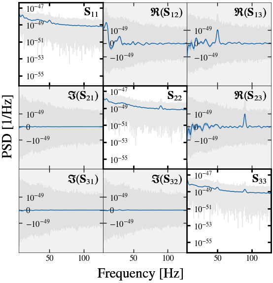
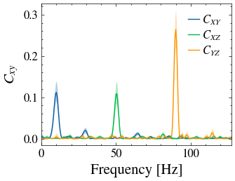

---
jupytext:
  text_representation:
    extension: .md
    format_name: myst
    format_version: 0.13
    jupytext_version: 1.14.1
kernelspec:
  display_name: Python 3
  language: python
  name: python3
---

# ET Example

Here we have an example of how to use this package to estimate a PSD from ET data.
The data is a small subset of the ET data used in the paper for this work.

```{code-cell} ipython2
import time
import h5py
import os
import matplotlib.pyplot as plt
import numpy as np
from sgvb_psd.psd_estimator import PSDEstimator
import urllib.request


def load_et_data() -> np.ndarray:
    """
    Return (n_samples, 3) array of XYZ channels
    """
    fname = "et_data.h5"
    # Download the data if it does not exist
    if not os.path.exists(fname):
        urllib.request.urlretrieve(
            "https://github.com/nz-gravity/sgvb_psd/raw/main/docs/examples/et_data.h5",
            fname
        )

    with h5py.File("et_data.h5", "r") as f:
        channels = np.column_stack([
            f["X"][:],
            f["Y"][:],
            f["Z"][:]
        ])
        return channels


data = load_et_data()

N_theta = 400
start_time = time.time()
optim = PSDEstimator(
    x=data,
    N_theta=N_theta,
    nchunks=128,
    fs=2048,
    ntrain_map=1000,
    fmax_for_analysis=128,
    degree_fluctuate=N_theta,
    seed=0,
)

optim.run(lr=0.003)  # remove lr to run-hyperoptimisation (takes a long time)
end_time = time.time()
estimation_time = end_time - start_time
print(f'The estimation time is {estimation_time:.2f}s')

optim.plot_coherence(labels='XYZ')
plt.savefig("ET_coherence.png")
plt.close()

optim.plot(xlims=[5, 128], labels='XYZ')
plt.savefig("ET_psd.png")
plt.close()

optim.plot_vi_losses()
plt.savefig("ET_vi_losses.png")
plt.close()
```







