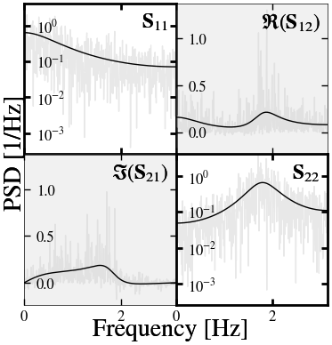
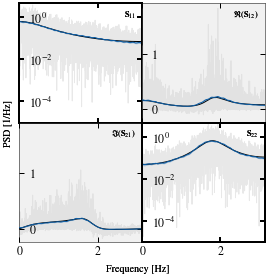
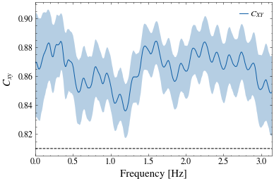
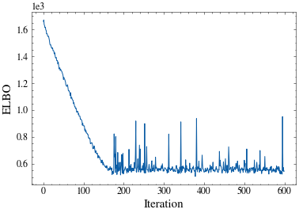

---
jupytext:
  text_representation:
    extension: .md
    format_name: myst
    format_version: 0.13
    jupytext_version: 1.14.1
kernelspec:
  display_name: Python 3
  language: python
  name: python3
---

# Simulation Example

Here we demonstrate how to use this package to estimate the multivariate PSD of VAR(2) simulated data.

```{code-cell} ipython2
import numpy as np
import matplotlib.pyplot as plt

from sgvb_psd.utils.sim_varma import SimVARMA

np.random.seed(0)

var2 = SimVARMA(
    n_samples=1024,
    var_coeffs=np.array(
        [[[0.5, 0.0], [0.0, -0.3]], [[0.0, 0.0], [0.0, -0.5]]]
    ),
    vma_coeffs=np.array([[[1.0, 0.0], [0.0, 1.0]]]),
    sigma=np.array([[1.0, 0.9], [0.9, 1.0]]),
)
var2
```

```{code-cell} ipython2
var2.plot(off_symlog=False, xlims=[0, np.pi])
plt.savefig(f"var2_data.png")
plt.close();
```



```{code-cell} ipython2
from sgvb_psd.psd_estimator import PSDEstimator

optim = PSDEstimator(
    x=var2.data,
    N_theta=30,
    nchunks=1,
    ntrain_map=1000,
    max_hyperparm_eval=5,
    fs=2 * np.pi,
)
optim.run(lr=0.003)
_ = optim.plot(
    true_psd=[var2.psd, var2.freq],
    off_symlog=False,
    xlims=[0, np.pi],
)
plt.savefig(f"var2_psd.png")
plt.close()
```



```{code-cell} ipython2
_ = optim.plot_coherence(true_psd=[var2.psd, var2.freq], labels="XY")
plt.savefig(f"var2_coh.png")
plt.close()
```



```{code-cell} ipython2
_ = optim.plot_vi_losses()
plt.savefig(f"var2_vi_losses.png")
plt.close()
```


